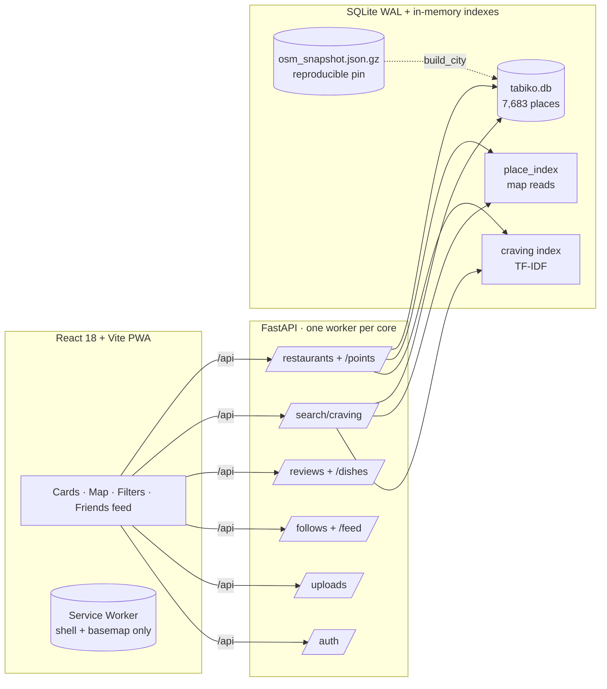

<div align="center">


[](https://github.com/syedhaamidk/Tabiko/actions/workflows/ci.yml)
[](backend/)
[](frontend/)
[](backend/app/database.py)
[](docker-compose.yml)
[](#-verification)
[](https://www.openstreetmap.org/copyright)
[](LICENSE)

<sub><b>BIG FLAVOR. ZERO BORING BITES.</b></sub>

# Follow the flavor. Find the funk.

Tabiko is your neon-lit neighborhood table: real cravings, cult dishes, local intel, and a map that changes mood with every cuisine.

**7,683** Bengaluru places &nbsp;·&nbsp; **17** cuisines mapped &nbsp;·&nbsp; **0** pay-to-play spots

**✦ TABIKO ✦ SPICY ✦ LOCAL ✦ MESSY ✦ COFFEE ✦ FRESH ✦ COMFORT ✦ DATE NIGHT ✦ STREET FOOD ✦**

[Quick start](#pick-your-view--quick-start) · [What it does](#fresh-from-the-table--what-it-does) · [The mood map](#the-mood-changes-with-every-cuisine) · [Architecture](#under-the-counter--architecture) · [API](#api-surface) · [Verification](#receipts--verification) · [Deployment](#one-command--deployment)

</div>

---

<sub><b>FRESH FROM THE TABLE</b></sub>
## What it does

| | |
|---|---|
| **Self-drawn map** | No tile provider, no API key, no per-request cost. Vendored OSM geometry rendered as styled vectors on a blank Leaflet canvas — Sunset and After-dark themes recolor it live. |
| **Craving radar** | TF-IDF ranking over dish + review text. Reports `unmatched_terms` instead of confidently ranking irrelevant places. |
| **Proximity that tells the truth** | `origin_lat/lon` + `radius_m` + `distance` sort, with `distance_m` on every row and `X-Total-Count` for honest counts. A radius without an origin is a `422`, never a silent 200. |
| **Friends, not followers** | Follow readers, filter any place to “people I follow”, chronological Friends feed. Immediate, idempotent, no requests, no algorithm. |
| **Photos** | Dish + review uploads with magic-byte validation, content-addressed storage, served via the API. |
| **Menus by the people who ate there** | The empty state is an invitation. Paste a whole menu in one request — duplicates reported, not rejected. Every dish credits its contributor. |
| **Offline-first PWA** | Installable, precached shell + basemap. `/api` is never cached. |
| **In-app directions** | Walkable routing graph built from the same vendored streets the map draws. Rajajinagar only — elsewhere it says so instead of faking it. |

---

<sub><b>PICK YOUR VIEW</b></sub>
## Quick start

### One command (recommended)

```bash
# Set a real secret first — compose refuses to start without it
export TABIKO_JWT_SECRET="$(python -c 'import secrets; print(secrets.token_urlsafe(48))')"

docker compose up -d --build
```

Open **http://127.0.0.1:8010** — API + frontend on one origin. First boot builds the city from the committed snapshot (~7,683 places), migrates, and serves.

> Taking it public for free? See **[DEPLOY.md](DEPLOY.md)** — one Fly.io machine, one persistent volume, TLS included, sleep-when-idle.

### Local development

**Backend** — `http://127.0.0.1:8010` · Swagger at `/docs`

```bash
cd backend
python -m venv .venv && source .venv/bin/activate  # Windows: .\.venv\Scripts\Activate.ps1
pip install -r requirements-dev.txt
alembic upgrade head
uvicorn app.main:app --host 127.0.0.1 --port 8010
```

**Frontend** — `http://127.0.0.1:5173` (proxies `/api` → `:8010`)

```bash
cd frontend
npm install
npm run dev
```

> Place intel © OpenStreetMap contributors. Displayed with attribution in the UI.

---

<sub><b>THE MOOD CHANGES WITH EVERY CUISINE</b></sub>
## The mood map

Every cuisine gets its own palette + display face, set per place through `/restaurants/{id}/theme`. Same mechanism the app uses — this legend is the token file talking:


Every display surface reads its font from the theme tokens (`--font-display` / `--font-body`) — never a hardcoded string — so a future font-pair change moves all 29 spots at once. Covered by `frontend/src/styles/fontTokens.test.js`, which resolves the real stylesheet against the real token file.

---

<sub><b>UNDER THE COUNTER</b></sub>
## Architecture



**Key decisions**

- **The city is a build output.** `backend/data/osm_snapshot.json.gz` + `city_provenance.json` → byte-identical tables on any clean clone, no network, no key. `--verify` diffs without touching live data; `--refresh` is the only networked mode.
- **Cards and map share one filter object**, so they can never disagree about what “biryani within 2 km” means.
- **Migrations own the schema.** `create_all` is banned — it collided with `alembic upgrade` on fresh databases.
- **Short-lived access (30 min) + rotating refresh (30 d, digests only).** Replay outside a 30 s grace window = theft → revoke every session for that user.

---

<sub><b>TABLE STAKES</b></sub>
## Tech stack

| Layer | Choice |
|---|---|
| Backend | Python 3.12+, FastAPI 0.136, SQLAlchemy 2.0, Pydantic 2.13, Alembic, PyJWT, bcrypt |
| Frontend | React 18.3, Vite 7.3, Leaflet 1.9 (renderer only — **no tiles**), Vitest 5 + Testing Library |
| Data | SQLite (WAL, `synchronous=NORMAL`), pinned OSM snapshot bbox `12.75,77.45,13.15,77.80` |
| Infra | Multi-stage Dockerfile (Node build → Python serve), `docker-compose.yml` + named volume, GitHub Actions (4 jobs) |

---

<sub><b>THE FULL MENU</b></sub>
## API surface

30 endpoints under `/api` in production (prefix stripped in dev so both agree).

<details>
<summary><b>Core, auth, menus & reviews, saved & search, moderation, uploads</b></summary>

| Area | Endpoints |
|---|---|
| Core | `GET /stats` · `GET /filter-options` · `GET /restaurants` · `GET /restaurants/points` · `GET /restaurants/{id}` · `GET /restaurants/{id}/theme` · `GET /restaurants/{id}/stats` |
| Auth | `POST /auth/register` (5/min) · `POST /auth/login` (10/min) · `POST /auth/google` (10/min) · `POST /auth/refresh` (30/min) · `POST /auth/logout` · `GET/PATCH /auth/me` · `GET /auth/providers` |
| Menus & reviews | `GET/POST /restaurants/{id}/dishes` · `POST /restaurants/{id}/dishes/bulk` · `PATCH /restaurants/{id}/confirm-menu` · `POST /reviews` · `GET /reviews/restaurant/{id}?following_only=true` · `GET/DELETE /users/{id}/follow` · `GET /feed/following` |
| Saved & search | `GET /favorites` · `PUT/DELETE /favorites/{id}` · `GET /favorites/places` · `GET /search/craving?q=` · `GET /users/search?q=` |
| Moderation | `GET /reviews/flagged` · `PATCH /reviews/{id}/moderation` (admin) |
| Uploads | `POST /uploads` (auth, 30/hr, PNG/JPEG/GIF/WEBP/BMP, 5 MB) · `GET /uploads/{name}` (public, `nosniff`) |

Retrying a review with the same `client_request_id` returns `409` before aggregates change. `following_only=true` while logged out is `401` — “you follow nobody” and “you’re not signed in” are different answers.

</details>

---

<sub><b>FINE PRINT, READ IT</b></sub>
## Configuration

<details>
<summary><b>Environment variables</b></summary>

```bash
TABIKO_DATABASE_URL=sqlite:////data/tabiko.db   # the line that matters — volume-mounted, or container replacement eats reader data
TABIKO_JWT_SECRET=replace-with-a-long-random-secret  # ≥32 chars, required outside dev
TABIKO_ENV=production
TABIKO_ADMIN_EMAILS=you@example.com
TABIKO_GOOGLE_CLIENT_ID=                          # empty = no Google button; see below
TABIKO_CORS_ORIGINS=https://tabiko.example
TABIKO_TRUST_PROXY=false                          # only true behind something that overwrites X-Forwarded-For
TABIKO_LOGIN_RATE_LIMIT=10
TABIKO_REGISTER_RATE_LIMIT=5
TABIKO_GOOGLE_RATE_LIMIT=10
TABIKO_UPLOAD_RATE_LIMIT=30
TABIKO_USER_SEARCH_LIMIT=25
TABIKO_FEED_LIMIT=50
```

Full list in `backend/.env.example` (`backend/.env` is gitignored). Never put secrets in `VITE_*` variables — Vite inlines them into the client bundle.

<details>
<summary><b>Google sign-in setup (5 minutes, once)</b></summary>

The server verifies Google ID tokens itself, so all it needs is the OAuth
client ID of a Web application:

1. [Google Cloud Console](https://console.cloud.google.com/) → APIs & Services → Credentials → **Create Credentials → OAuth client ID → Web application**.
2. Under **Authorized JavaScript origins**, add every origin the app is served from — `http://localhost:5173` for local dev and the production domain when deployed. Google refuses to issue tokens to origins not on this list.
3. Copy the client ID into `TABIKO_GOOGLE_CLIENT_ID` and restart. The Google button appears on its own; empty means it never renders and `POST /auth/google` answers 503.

No client secret is needed and none is stored: the Identity Services button flow never uses one. A reader signing in with an address that already has a password account keeps that account (and its reviews) — the Google identity links onto it. Only verified Google emails can create or claim accounts.

</details>

</details>

---

<sub><b>RECEIPTS</b></sub>
## Verification

| Suite | Count |
|---|---|
| Backend (`cd backend && pytest -q`) | **480 passing** |
| Frontend (`cd frontend && npm test`) | **158 passing** |
| Total | **659 passing** |
| Lint / format / migrations | `ruff check`, `ruff format --check`, `alembic check` — clean |
| Security audit | `npm audit --audit-level=high` — clean |

```bash
cd backend && pytest -q && python -m ruff check app tests scripts migrations && python -m alembic check
cd ../frontend && npm test && npm run build
python -m scripts.preflight            # deployment gate — refuses to start misconfigured deploys
python -m scripts.build_city --verify  # diff a rebuild against live data, change nothing
```

CI (`.github/workflows/ci.yml`) runs **backend · frontend · docker · snapshot** on every push/PR, plus a nightly **backup** workflow that takes a backup, destroys reader data, restores, and fails if the rows don’t come back.

> Deep dive: [`PROJECT_REPORT.md`](PROJECT_REPORT.md) — provenance, coverage tables, every bug found by running the thing, measured performance.

---

<sub><b>WHAT'S ACTUALLY ON THE TABLE</b></sub>
## Data & coverage

- **7,683 places** across greater Bengaluru (`12.75,77.45,13.15,77.80`), all with address + cuisine label.
- **40.6%** from a real OSM `cuisine` tag · **59.4%** derived from the venue tag (`raw_cuisine_tag` left empty so derivation is never mistaken for source).
- **77 reference dishes** across 13 well-known venues, labelled as reference/seed data — never attributed to a person.
- Every filter option publishes its **real count**; 22 values match nothing and show “none yet” instead of hiding.
- 1,327 places carry accessibility flags, now filterable.

---

<sub><b>HOW THE KITCHEN IS LAID OUT</b></sub>
## Project layout

<details>
<summary><b>Directory map</b></summary>

```text
tabiko/
├── backend/
│   ├── app/            FastAPI · auth · search · trust · ingestion · themes · uploads · follows
│   ├── migrations/     Alembic — the sole schema authority (9 revisions)
│   ├── scripts/        build_city · backup/restore · preflight · probes · seed_reference_data
│   ├── data/           osm_snapshot.json.gz + city_provenance.json (the reproducible pin)
│   └── tests/          480 tests
├── frontend/
│   ├── src/            App · 16 components · theme + auth contexts · api client
│   ├── scripts/        neighborhood + citywide map builders · PWA icon rasteriser
│   └── public/data/    vendored basemap geometry (no tile requests, ever)
├── docker/             entrypoint.sh — preflight → build-if-empty → migrate → serve
├── .github/workflows/  ci.yml (4 jobs) · backup.yml (nightly prove-the-restore)
├── Dockerfile          Node build → Python runtime, 285 MB
└── docker-compose.yml  one command to deploy
```

`backend-2/` is an archived feature draft — documented, superseded, do not run as a service.

</details>

---

<sub><b>NO BORING BITES — INCLUDING THE TRUTH</b></sub>
## Known limits (stated plainly)

- **Menus are seed-only.** OSM carries no menu data; the contribution flow exists and waits on real readers.
- **9 of 11 occasion filters match nothing** (`date`, `family`, `work`… need reader-supplied tags).
- **Directions cover Rajajinagar only** — the one area with street-level geometry.
- **Arterials at city zoom**, full streets at neighborhood zoom (218k highway ways can’t be vendored).
- **No venue photos yet** — needs a Places/Mapillary key.
- **Single box.** SQLite + per-box uploads; worker *processes* (one per core) scale it, a fleet needs shared storage.

---

<sub><b>HEY, FLAVOR CHASER</b></sub>
## Contributing

```bash
git clone https://github.com/syedhaamidk/Tabiko.git
cd Tabiko
docker compose up -d --build   # full deployment, city builds itself on first boot
```

Report bugs with reproduction steps. Don’t invent data — no fake counts, cuisines, street names, or dishes. Run the verification commands above before opening a PR.

---

## License

MIT — see [LICENSE](LICENSE).

Place data © OpenStreetMap contributors ([ODbL](https://www.openstreetmap.org/copyright)). The pinned snapshot in `backend/data/` is OSM-derived; attribution is shown in the UI.

---

<div align="center">

**✦ GOOD FOOD · NO BORING BITES ✦**

*Cooked up with masala & main-character energy*

Place intel © OpenStreetMap contributors · Built with FastAPI, React, and Leaflet-as-a-canvas

</div>
